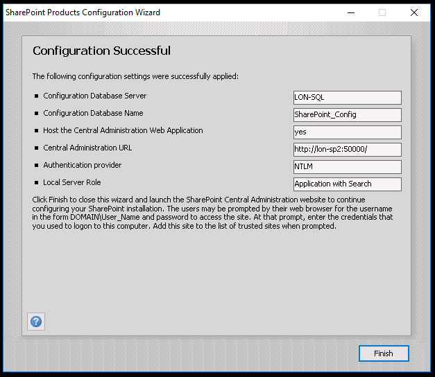

# Module 01-Lab 1: Configure and update SharePoint Farm

## Microsoft 365 user interface 

Given the dynamic nature of Microsoft cloud tools, you may experience user interface (UI) changes that were made following the development of this training content. This will manifest itself in UI changes that do not match up with the detailed instructions presented in this lab manual.

The Microsoft World-Wide Learning team will update this training course as soon as any such changes are brought to our attention. However, given the dynamic nature of cloud updates, you may run into UI changes before this training content is updated. **If this occurs, you will have to adapt to the changes and work through them in the lab exercises as needed.**

## Lab Scenario 

In the labs of this course you are the Administrator for Adatum Corporation, and you have two Windows servers and a SQL server deployed in a virtualized lab environment. Your server team has completed the following settings for you:

  - Created service accounts for the farm, web apps and services in AD DS.

  - Installation of SharePoint Server 2019 on LON-SP1 and LON-SP2.

  - Installation of SQL Server on LON-SQL.

In this lab, you will configure a SharePoint 2019 farm across 2 SharePoint servers and 1 Database server.

- **Exercise 1: Configure SharePoint Server 2019 (30 minutes)**

  - Task 1: Run the SharePoint Products Configuration Wizard on LON-SP2

  - Task 2: Run the SharePoint Products Configuration Wizard on LON-SP1

  - Task 3: Check build version in SharePoint Central Administration

- **Exercise 2: Install update for SharePoint Server 2019 (40 minutes)**

  - Task 1: Download the latest updates

  - Task 2: Install the latest updates

  - Task 3: Finalize implementation of updates

## Objectives

After you complete this lab, you will be able to:

  - Configure SharePoint Server 2019 with a 2-server farm

  - Update SharePoint Server 2019 to the latest patch level

## Lab Setup 

  - **Estimated Time:** 60 minutes.

## Instructions

## Before you start

### Review the lab virtual machines

The following are the virtual machines provided for this course. You will log in to the VM as a local administrator. The instructor will provide the sign-in information.

  - LON-DC1: Domain controller

  - LON-SP1: SharePoint Server with SharePoint 2019 installed.

  - LON-SP2: SharePoint Server with SharePoint 2019 installed.

  - LON-SQL: SQL Server with SQL Server management tools installed.

## Exercise 1: Configure SharePoint Server 2019 Farm

In the first exercise you will walk through the configuration steps to create a SharePoint 2019 farm. We are starting with LON-SP2 as this will be the server hosting the application and search services. Also, the server which is used to create the farm will be the server which will host the Central Administration web site by default. Recommendations have this service hosted on servers which are not used by end users, such as web front end server roles.

### Task 1 – Run the SharePoint Products Configuration Wizard on LON-SP2 

In this task you will use the SharePoint Products Configuration Wizard to setup a new farm on LON-SP2 server.

1.  In your Lab Session, switch to **LON-SP2** virtual machine and login as the SharePoint Farm Administrator (**ADATUM\\SPFarm**)

2.  On the **Start** menu, expand **Microsoft SharePoint 2019 Products**, and select **SharePoint 2019 Products Configuration Wizard**.  
    
    

3.  If you receive a **User Account Control** dialog, select **Yes** to allow changes to the server.  
    

4. Follow the instructions on the **SharePoint 2019 Products Configuration Wizard** with the following information.

  - Select **Next \>** on the Welcome to SharePoint Products page.  
    

  - Select **Yes** to continue in the warning pop-out.  
    

  - In the **Connect to a server farm** page, select the option to **Create a new server farm**, select **Next \>**.  
    

  - In the **Specify Configuration Database Settings** page, use the following information to fill out the page, then select **Next \>**.
    
      - Database Server: **LON-SQL**
    
      - Under the **Specify Database Access Account** section
        
          - Username: **ADATUM\\SPFarm**
        
          - Password: **Pa55w.rd**

    

  - In the **Specify Farm Security Settings** page, use the following information to fill out the page, then select **Next \>**. Please keep this information as it will be used to join servers to the farm later in the process.
    
      - Passphrase: **Pa55w.rd**
    
      - Confirm passphrase: **Pa55w.rd**

    

  - In the **Specify Server Role** page, use the following information to configure the server’s role in the farm.
    
      - Under **Shared Roles** section, select **Application with Search**
    
      - Select **Next \>.**

    

  - In the **Configure SharePoint Central Administration Web Application** page, use the following information to configure the required settings.
    
      - Select the box to **Specify port number**, provide the value of **50000**
    
      - In the **Configure Security Settings** section, specify **NTLM** as the authentication provider of the central administration web application.
    
      - Select **Next \>.**

    

  - In the **Completing the SharePoint Products Configuration Wizard** page, review the provided information, select **Next \>**.  
    

  - It will take some time for the wizard to complete. When the process is finished you will be presented with a **Configuration Successful** page, which shows all the details of what was configured. Select **Finish** to close out the wizard.  
    

After closing out the wizard on LON-SP2, a browser will come up and load the central administration web site. Close the browser. We need to add the second server to the farm before continuing with central administration.

You have now successfully created a SharePoint 2019 farm. Proceed to the next task.

### Task 2 - Run the SharePoint Products Configuration Wizard on LON-SP1 

In this task you will use the SharePoint Products Configuration Wizard to join a server to an existing farm on LON-SP1 server.

1.  In your Lab Session, switch to **LON-SP1** virtual machine and login as SharePoint Farm Administrator (Adatum\\SPFarm).

2.  On the **Start** menu, expand **Microsoft SharePoint 2019 Products**, select **SharePoint 2019 Products Configuration Wizard**.

3.  If you receive a **User Account Control** dialog, select **Yes** to allow changes to the server.

4.  Follow the instructions on the **SharePoint 2019 Products Configuration Wizard** with the following information.
    
      - Select **Next \>** on the Welcome to SharePoint Products page.  
        
    
      - For the warning pop up, which is presented, select **Yes** to continue.  
        
    
      - In the **Connect to a server farm** page, select the option to **Connect to an existing server farm**, select **Next \>**.  
        
    
      - In the **Specify Configuration Database Settings** page, use the following information to fill out the page, then select **Next \>**.
        
          - Database Server: **LON-SQL**
        
          - Select **Retrieve Database Names** button
        
          - Database Name: **SharePoint\_Config** (Should default as this is the only config DB)
        
          - Select **Next \>**.

        

  - In the **Specify Farm Security Settings** page, use the passphrase (**Pa55w.rd**) to fill out the page, then select **Next \>**. This is the passphrase entered when creating the farm that all other servers need to use to join the farm.

  - In the **Specify Server Role** page, use the following information to configure the server’s role in the farm.
    
      - Under **Shared Roles** section, select **Front-end with Distributed Cache**
    
      - Select **Next \>.**

    

  - In the **Completing the SharePoint Products Configuration Wizard** page, review the provided information, select **Next \>**.  
    

  - When the process is finished you will be presented with a **Configuration Successful** page, which sows all the details of what was configured. Select **Finish** to close out the wizard.  
    

5.  Upon finishing the SharePoint Products Configuration Wizard, Internet Explorer will load and navigate to the farm central administrations web site. If this is the first time Internet Explorer is loaded, it will present a **Set up Internet Explorer 11** dialog. Make sure the option for **Use recommended security, privacy and compatibility settings** is selected and select **Ok**.

    

6.  In Central Admin there is an option on **How do you want to configure this SharePoint Server**, select the **No, I will configure everything myself** option.  
    

You have now successfully joined a server to a SharePoint 2019 farm. Proceed to the next task.

### Task 3 – Check the build version in SharePoint Central Administration 

For this task we need to determine what the current build of SharePoint 2019 is by looking in Central Administration. This will determine if we need to update the SharePoint farm.

1.  In your Lab Session, switch to **LON-SP2** virtual machine and login as SharePoint Farm Administrator (Adatum\\SPFarm).

2.  On the **Start** screen, type **SharePoint 2019 Central Administration**, and **press Enter**.

3.  In Central Administration page, select on **Manage Servers in this farm**. You can see the **version** of the SharePoint Farm, and the status for each of the servers should show **No Action Required**.  
      
    

You have successfully completed this task. You have finished the first exercise and you can continue to the next one.

## Exercise 2: Install SharePoint Server 2019 updates

In this exercise you will download, install and apply updates to the SharePoint Server 2019 farm.

### Task 1 – Download the latest updates

Before you can install updates, we must first download the updates. Use the following steps to download the updates to each of the SharePoint servers in the farm.

1.  In your Lab Session, switch to **LON-SP1** virtual machine and login as SharePoint Farm Administrator(Adatum\\SPFarm).

2.  Open **Internet Explorer**, and browse to the following URL
    
      - <https://docs.microsoft.com/en-us/OfficeUpdates/sharepoint-updates>
    
      - You can also go to **Central Admin** \> **Upgrade and Migration** \> **Check Product and patch installation status** \> and select on **Click here for the latest information on available updates for SharePoint Products.** Which will lead you to the same location as the link above.

3.  Select on the latest **KB Number** under **SharePoint 2019 update history** section  
    

4.  The description of the update will load. Scroll down and select the link under **Microsoft Download Center** to be redirected to the download page for the update.  
    

5.  Download the update from the Microsoft Download Center. Select **English**, Select **Download**. Save the file to the **Downloads** folder on the local server.

6.  Repeat the steps above for LON-SP2.

Once you have downloaded the update file on both SharePoint servers, you have successfully completed this task and can continue with the next task.

### Task 2 – Install the latest updates 

Updates can be installed in parallel on each of the servers. Use the following steps to install the updates to each of the SharePoint servers in the farm.

1.  In your Lab Session, switch to **LON-SP1** virtual machine and login as SharePoint Farm Administrator(Adatum\\SPFarm).

2.  Navigate to the **Downloads** folder in the **File Explorer**

3.  Double-select the KB update file to start the execution of the update on the server. You may see a User Account Control Dialog pop up, if so, select **Yes**.

4.  The Security Update will present a dialog to **accept the Microsoft Software License Terms**. Check the box in the bottom left of the dialog to accept these terms and select **Continue**.

    

5.  While the installation process is happening on LON-SP1, Repeat the steps above for LON-SP2

6.  When both servers show the installation completed dialog box, the installation of the update is complete. It can take about 15 min to install the update.

When the installation of the update is complete on both servers, this task is completed, and you can move to the next task.

### Task 3 – Finalize implementation of updates

After the update has been downloaded and installed, on each server, it must be applied to each server as well. Typical process with a multi-server farm is to first finalize the installation on all servers which do not host central administration, in this case LON-SP1. Then, last, do the server hosting central administration, in this case LON-SP2. Follow the steps below to apply the updates.

1.  In your Lab Session, switch to **LON-SP1** virtual machine and login as SharePoint Farm Administrator(Adatum\\SPFarm).

2.  On the **Start** screen, type **SharePoint 2019 Central Administration**, and **press Enter**.

3.  In Central Administration page, select on **Manage Servers in this farm**. You can see the **version** of the SharePoint Farm is still the old version, and the status for each of the servers should now show **Upgrade Required**.  

    

4.  On the **Start** screen, type **SharePoint 2019 Products and Configuration Wizard**, and **press Enter**.

5.  On the **Welcome to SharePoint Products** page of the **SharePoint Products Configuration Wizard**, press **Next \>**. 

    

6.  For the warning pop up, which is presented, select **Yes** to continue.  
    

7.  On the **Completing the SharePoint Products Configuration Wizard**, review the settings for your database server and database name to be updated. Select **Next \>**.  
    

8.  When the process is complete, the **Configuration Successful** screen will display a message that it is complete. Select **Finish**. 
 
    

9.  Repeat steps 4 thru 8 on LON-SP2.

10. When the process completes on LON-SP2, Open **Central Administration** and select **Manager servers in the farm**. This page is now updated with the most recent version and the servers no longer have an action required.

Once the version is updated and the servers require no further action, this task is complete.

END OF LAB

