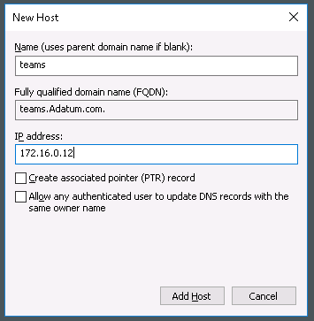
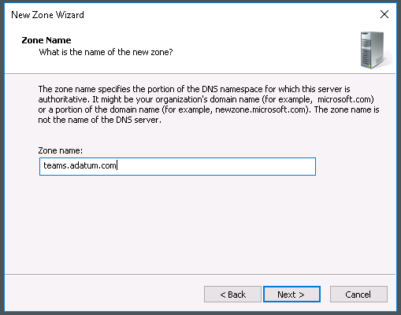

# Module 03-Lab 1: Create and Configure web applications 

## Microsoft 365 user interface 

Given the dynamic nature of Microsoft cloud tools, you may experience user interface (UI) changes that were made following the development of this training content. This will manifest itself in UI changes that do not match up with the detailed instructions presented in this lab manual.

The Microsoft World-Wide Learning team will update this training course as soon as any such changes are brought to our attention. However, given the dynamic nature of cloud updates, you may run into UI changes before this training content is updated. **If this occurs, you will have to adapt to the changes and work through them in the lab exercises as needed.**

## Lab Scenario 

In the labs of this course you are the Administrator for Adatum Corporation, and you have two Windows servers and a SQL server deployed in a virtualized lab environment. In the previous module you completed the following:

  - Created a 2 server SharePoint Server 2019 Farm

  - Updated a SharePoint 2019 Farm to the latest updates

In this lab, you will create and configure a SharePoint 2019 web application.

- **Exercise 1: Create a web applications (20 minutes)**

  - Task 1: Configure DNS for the new web application

  - Task 2: Register Service Accounts as SharePoint Managed Accounts

  - Task 3: Create the web applications

  - Task 4: Disable loopback checking for the required domains


- **Exercise 2: Create site collections (15 minutes)**

  - Task 1: Use Central Administration to create a top-level site collection

  - Task 2: Use Windows PowerShell to create new content databases

  - Task 3: Use Windows PowerShell to create new site collections

## Objectives

After you complete this lab, you will be able to:

  - Create and configure a SharePoint Server 2019 web application

  - Create a site collection via the Central Administration GUI as well as using PowerShell

## Lab Setup 

  - **Estimated Time:** 35 minutes.

## Instructions

## Before you start

### Review the lab virtual machines

The following are the virtual machines provided in this course. You will log in to the VM as a local administrator. The instructor will provide the sign-in information.

  - LON-DC1: Domain controller

  - LON-SP1: SharePoint Server with SharePoint 2019 installed.

  - LON-SP2: SharePoint Server with SharePoint 2019 installed.

  - LON-SQL: SQL Server with SQL Server management tools installed.

## Exercise 1: Create a web application

In the first exercise you will walk through the steps to create a new web application in your multi-server SharePoint Server 2019 farm.

### Task 1 – Configure DNS for the new web application 

In this task you will configure a friendly URL in DNS to access your web application over the network.

1.  In your Lab Session, switch to LON-DC1 virtual machine as Administrator (Adatum\\administrator).

2.  Validate the IP Address of **LON-SP1**.
    
      - Open the **Start** menu and type **CMD**, select to open the **Command Prompt**.
    
      - In the command prompt type in **ping lon-sp1**, press **enter**.
    
      - Copy the **IP Address** returned.

        

3.  On the **Start** menu, select **Windows Administrative Tools**, select **DNS**.  
    
    

4.  In the left pane, select and expand **LON-DC1**, expand **Forward Lookup Zones**, expand **adatum.com** domain.
    
      - Right-select on **adatum.com** domain in the left pane, then select **New Host (A or AAAA)** option.  
        

5.  Use the following information to fill out the New Host dialog.
    
      - Name: **teams**
    
      - IP Address: **(use the IP Address from the command prompt output)**

    

6.  Select **Add Host**. A confirmation box will pop up, select **OK**. When complete, select **Done** to close the New Host dialog.

7.  While still in **DNS Manager**, right-select **Forward Lookup Zones**, then select **New Zone**.

8.  The **New Zone Wizard** dialog will be presented, click **Next \>**.  
    

9.  Leave the defaults as shown below, select **Next \>**.  
    

10. Leave the defaults as shown below, select **Next \>**.  
    

11. Enter **teams.adatum.com** as the zone name, select **Next \>**.  
    

12. Leave the defaults as shown below, select **Next \>**.  
    

13. The final page is a summary of the request, select **Finish**.  
    

14. While still in **DNS Manager**, expand **LON-DC1**, expand **Forward Lookup Zones**, right-select **teams.adatum.com** and select **New Host (A or AAAA)**.  
    

15. Enter in the **IP Address** previously copied from the command prompt earlier in this task, select **Add Host**. A confirmation box will pop up, select **OK**. When complete, select **Done** to close the New Host dialog.  
    

You have now successfully created the DNS entry for the new web application. Proceed to the next task.

### Task 2 – Register Service Accounts as SharePoint Managed Accounts 

In this task you will configure managed accounts in SharePoint to be used with web applications.

1.  In your Lab Session, log on to **LON-SP2** virtual machine as the SharePoint Farm Administrator (Adatum\\SPFarm).

2.  On the **Start** menu, expand **Microsoft SharePoint 2019 Products**, select **SharePoint 2019 Central Administration**.

3.  In Central Administration, select **Security**, then on the Security page, under **General Security**, select **Configure Managed Accounts**. 

    

4.  On the **Managed Accounts** page, select **Register Managed Account**.

5.  Create a new managed account by entering the following information into the form, then click **OK**.
    
      - Service Account Credentials -\> Username: **adatum\\spwebapp**
    
      - Service Account Credentials -\> Password: **Pa55w.rd**

    

You have successfully completed this task. Please continue to the next task.

### Task 3 – Create the web application 

In this task you will create a web application which used the managed account and DNS created in the previous tasks.

1.  Log on to **LON-SP1** virtual machine as the SharePoint Farm Administrator (Adatum\\SPFarm).

2.  On the **Start** menu, expand **Microsoft SharePoint 2019 Products**, select **SharePoint 2019 Central Administration**.

3.  In Central Administration, select **Application Management**, then select **Manage Web Applications**. 

    

4.  To create a new web application, select **New** from the ribbon at the top of the page.  

    

5.  There is a fair amount to fill out on the new web application form, use the following information to populate the form.
    
      - IIS Web Site: Select **Create a new IIS Web Site**
    
      - IIS Web Site Name: **SharePoint – teams.adatum.com**
    
      - Port: **80**
    
      - Host Header: **teams.adatum.com**
    
      - Path: **C:\\inetpub\\wwwroot\\wss\\VirtualDirectories\\teams80**
    
      - Application Pool: **Create new application pool**
    
      - Application Pool Name: **SharePoint – teams.adatum.com**
    
      - Select a security account for this application pool: **ADATUM\\SPWebApp**
    
      - Select **OK**.
    
      - Select **OK** after the creation is finished.

6.  On the **Start** screen, select **Windows Administrative Tools**, then select **Internet Information Services (IIS) Manager**.

7.  In IIS Manager left pane, expand **LON-SP1**, then expand **Sites** and select **SharePoint – teams.adatum.com**.

8.  In the **Actions** pane (on the right side), select **Bindings**.

9.  In the **Site Bindings** dialog, there should be an entry already for teams.adatum.com. Highlight that entry and select **Edit**. Use the drop down for **IP Address** to select the IP address provided.  

    

10. Select **OK**, then select **Close**

You have successfully completed this task. Please continue to the next task.

### Task 4 – Disable loopback checking for the required domains 

In this task you will disable loopback checking as this often interferes with accessing a local endpoint using DNS address.

1.  Log on to **LON-SP1** virtual machine as the SharePoint Farm Administrator (Adatum\\SPFarm).

2.  On the **Start** menu, type **regedit**, then **press enter**.

3.  In the Registry Editor, navigate to the following registry location :

    HKEY\_LOCAL\_MACHINE\\SYSTEM\\CurrentControlSet\\Control\\Lsa\\MSV1\_0

4.  Right-select **MSV1\_0**, select **New**, then select **Multi-String Value**.

5.  Enter **BackConnectionHostNames**, and **press Enter**.

6.  Right-select **BackConnectionHostNames**, select **Modify**.

7.  In the **Edit Multi-String** dialog, enter the following values into the **Value data** text box and select **OK**.
    
      - **teams.adatum.com**
      - **teams**

    

8.  If a warning dialog appears, select **OK**, then close the **Registry Editor**.

9.  On the **Start** screen, type **Command Prompt**, and **press Enter**.

10. At the command prompt, type **iisreset /noforce**, then **press Enter**.

11. When it is complete, you can close all the windows

You have now completed this task and the exercise. You can proceed to the next Exercise.

## Exercise 2: Create Site Collections

In this exercise you will create content for the SharePoint Server 2019 web application created in exercise 1.

### Task 1 – Use Central Administration to create a top-level site collection 

In this task you will create a top-level site collection for the web application created in exercise 1.

1.  Log on to **LON-SP1** virtual machine as the SharePoint Farm Administrator (Adatum\\SPFarm).

2.  On the **Start** menu, expand **Microsoft SharePoint 2019 Products**, select **SharePoint 2019 Central Administration**.

3.  In Central Administration, select **Application Management**, then select **Create Site Collections**.

4.  Using the following information, create a top-level site collection
    
      - Web Application: [**http://teams.adatum.com**](http://teams.adatum.com)
    
      - Title: **Teams Search**
    
      - URL: **/**
    
      - Template: **Enterprise Search Center** *(under the Enterprise tab)*
    
      - Primary Site Collection Administrator: **adatum\\administrator**
    
      - Select **OK**.

5.  Test accessing the new site collection by selecting the link provided once the site collection has been created.

6.  While in the Search Center (<http://teams.adatum.com/> **),** select the gear icon at up-right corner and select **Site settings,** then select **Site permissions**.

7.  Select **Teams Search Visitors.** Select **New** and add **everyone** to the group.

You have completed this task and may proceed onto the next task.

### Task 2 – Use Windows PowerShell to create new content databases 

In this task you will create a new content database using windows PowerShell for the web application created in exercise 1.

1.  Log on to **LON-SP1** virtual machine as the SharePoint Farm Administrator (Adatum\\SPFarm).

2.  On the **Start** menu, expand **Microsoft SharePoint 2019 Products**, and right-select **SharePoint 2019 Management Shell** to run as Administrator.

3.  At the command prompt, type the following command and **press Enter**.

    ```powershell
    New-SPContentDatabase -Name WSS\_Content\_Teams -WebApplication <http://teams.adatum.com>
    ```

You have completed this task and may proceed onto the next task.

### Task 3 – Use Windows PowerShell to create new site collections 

In this task you will create new site collections for the web application created in exercise 1.

1.  Log on to **LON-SP1** virtual machine as the SharePoint Farm Administrator (Adatum\\SPFarm).

2.  On the **Start** menu, expand **Microsoft SharePoint 2019 Products**, select **SharePoint 2019 Management Shell**.

3.  At the command prompt, type the following command and **press Enter**.

    ```powershell
    New-SPSite -Url “http://teams.adatum.com/sites/teamsite1” -ContentDatabase WSS_Content_Teams -Name “Modern Team Site 1” -OwnerAlias adatum\administrator -template “STS#3”
    ```

4.  Once it is finished, ppen **Internet Explorer** and navigate to **http://teams.adatum.com/sites/teamsite1**.

5.  If you open **Central Administration**, and navigate to the **Application Management** page, select **View all site collections**.

6.  Validate the web application, **http://teams.adatum.com** is selected and select the site collection **/sites/teamsite1**, is in the newly created **WSS\_Content\_Teams** content database.

END OF LAB
