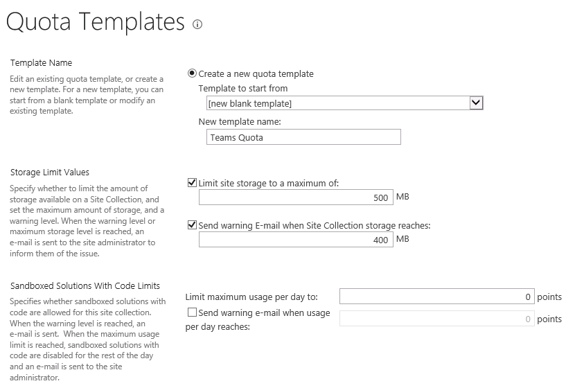
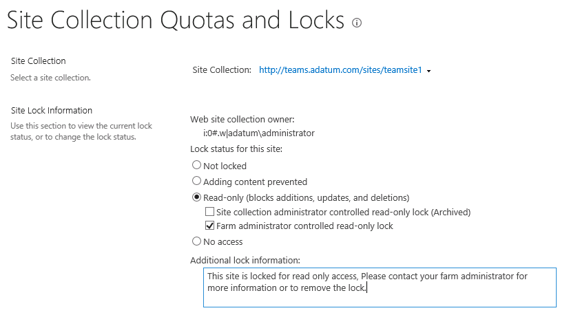
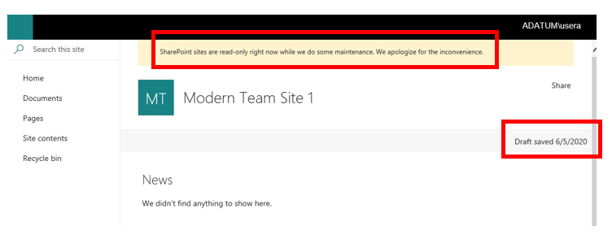
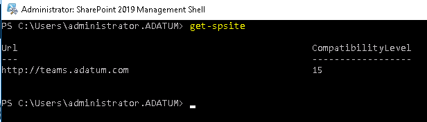
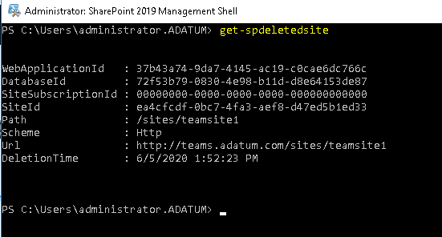
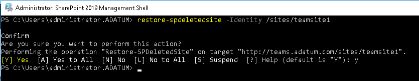
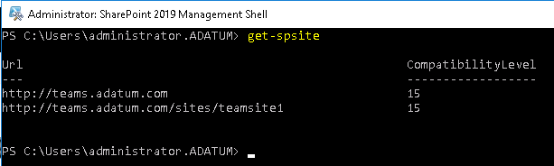

# Module 03- Lab2: Manage Site Collections and Permissions 

## Microsoft 365 user interface 

Given the dynamic nature of Microsoft cloud tools, you may experience user interface (UI) changes that were made following the development of this training content. This will manifest itself in UI changes that do not match up with the detailed instructions presented in this lab manual.

The Microsoft World-Wide Learning team will update this training course as soon as any such changes are brought to our attention. However, given the dynamic nature of cloud updates, you may run into UI changes before this training content is updated. **If this occurs, you will have to adapt to the changes and work through them in the lab exercises as needed.**

## Lab Scenario 

In the labs of this course you are the Administrator for Adatum Corporation, and you have to setup some governance limits to control the growth of your content capacity before it gets out of control.

  - Manage Site Collections quotas and locks

  - Use the site collection recycle bin

  - Create and Manage Permission Sets and Groups

In this lab, you will create and configure a SharePoint 2019 web application.

- **Exercise 1: Manage and configure site collection capacity governance (20 minutes)**

  - Task 1: Configure Site Collection Quotas

  - Task 2: Manage Site Collection Owners

  - Task 3: Manage Site Collection Locks

  - Task 4: Manage Site Collection Recycle Bin

- **Exercise 2: Manage site collection permissions (15 minutes)**

  - Task 1: Create and Manage Permission Sets

  - Task 2: Create and Manage SharePoint Groups

## Objectives

After you complete this lab, you will be able to:

  - Manage site collection capacity

  - Manage site collection permissions

## Lab Setup 

  - **Estimated Time:** 35 minutes.

## Instructions

## Before you start

### Review the lab virtual machines

The following are the virtual machines provided in this course. You will log in to the VM as a local administrator. The instructor will provide the sign-in information.

  - LON-DC1: Domain controller

  - LON-SP1: SharePoint Server with SharePoint 2019 installed.

  - LON-SP2: SharePoint Server with SharePoint 2019 installed.

  - LON-SQL: SQL Server with SQL Server management tools installed.

## Exercise 1: Manage and Configure Site Collection Capacity Governance

In the first exercise you will walk through the steps to manage capacity governance within the environment.

### Task 1 – Configure Site Collection Quotas 

In this task you will create and configure site collection quotas.

1.  Log on to **LON-SP1** virtual machine as the SharePoint Farm Administrator (Adatum\\SPFarm).

2.  On the **Start** menu, expand **Microsoft SharePoint 2019 Products**, select **SharePoint 2019 Central Administration**.

3.  In Central Administration, select **Application Management**, then on the Application Management page, under the **Site Collections** section, select **Specify quota templates**.

4.  Select **Create a new quota template** and enter in the following information
    
      - New Template Name: **Team Quota**
    
      - Storage Limit Values: Select the option for **Limit site storage to a maximum value of** and set the value to **500** MB
    
      - Storage Limit Values: Select the option for **Send warning E-mail when Site Collection storage reaches** and set the value to **400** MB
    
      - Select **OK**.
      
      

5.  Select **Configure quotas and locks**.

6.  Select the site collection created in the previous exercise with the URL of **http://teams.adatum.com/sites/teamsite1**.

7.  In the **Site Quota Information** section, use the drop down to select the **Teams Quota** template.

8.  Select **OK.**

You have now successfully created and applied a site quota template to a site collection. Proceed to the next task.

### Task 2 – Manage Site Collection Owners 

In this task you will manage site collection owners.

1.  Log on to **LON-SP1** virtual machine as the SharePoint Farm Administrator (Adatum\\SPFarm).

2.  On the **Start** menu, expand **Microsoft SharePoint 2019 Products**, select **SharePoint 2019 Central Administration**.

3.  In Central Administration, select **Application Management**, then on the Application Management page, under the **Site Collections** section, select **Change site collection administrators**.

4.  Select the site collection created in the previous exercise with the URL of **http://teams.adatum.com/sites/teamsite1**.

5.  Enter **adatum\\UserA** for the **Secondary Administrator**, select people picker icon  to resolve the user.

6.  Select **OK**.

You have successfully completed this task. Please continue to the next task.

### Task 3 – Manage Site Collection Locks 

In this task you will create a web application which used the managed account and DNS created in the previous tasks.

1.  Log on to **LON-SP1** virtual machine as the SharePoint Farm Administrator (Adatum\\SPFarm).

2.  On the **Start** menu, expand **Microsoft SharePoint 2019 Products**, select **SharePoint 2019 Central Administration**.

3.  In Central Administration, select **Application Management**, then on the Application Management page, under the **Site Collections** section, select **Configure Quotas and Locks**.

4.  Select the site collection created in the previous exercise with the URL of **http://teams.adatum.com/sites/teamsite1**.

5.  In the **Site Lock Information** section, select **Read-Only (blocks additions, updates, and deletions)** and check the box for **Farm administrator controlled read-only lock**.

6.  When selecting this option an option for **Additional lock information** is provided. **Enter a message** in this area for a user who may try to add, update, or delete content. The sample message:

    *This site is locked for read only access. Please contact your farm administrator for more information or to remove the lock.*

    

7.  Select **OK**.

8.  Right-select on IE and select the InPrivate browsing mode.

9.  Navigate to **http://teams.adatum.com/sites/teamsite1**, and login with **adatum\\UserA** credentials.

10. Notice UserA is a secondary site collection administrator and should have full control permissions throughout the site collection. However, the site is locked at the farm level even for site collection administrators. Notice the message at the top as well as of the lack of an edit button for the page.  

    

11. Navigate back to **Central Administration**, select **Application Management**, then on the Application Management page, under the **Site Collections** section, select **Configure Quotas and Locks**.

12. Select the site collection created in the previous exercise with the URL of **http://teams.adatum.com/sites/teamsite1**.

13. In the **Site Lock Information** section, select **Not Locked**.

14. Select **OK**.

You have successfully completed this task. At this point your site collection at /sites/teamsite1 should not have a read-only lock placed on the site. Please continue to the next task.

### Task 4 – Manage Site Collection Recycle Bin 

In this task you will delete a site collection and restore the site collection back using the site collection recycle bin.

1.  Log on to **LON-SP1** virtual machine as the SharePoint Farm Administrator (Adatum\\SPFarm).

2.  On the **Start** menu, expand **Microsoft SharePoint 2019 Products**, select **SharePoint 2019 Central Administration**.

3.  In Central Administration, select **Application Management**, then under the **Site Collections** section, select **Delete a site collection**.

4.  Select the site collection created in the previous exercise with the URL of **http://teams.adatum.com/sites/teamsite1**.

5.  Select **Delete**.

6.  A message will be presented asking if you are sure you want to permanently delete this web site and all its content, select **OK**.

7.  On the **Start** menu, expand **Microsoft SharePoint 2019 Products**, select **SharePoint 2019 Management Shell**.

8.  Type ```Get-SPSite``` in the management shell window. You can see the site we deleted does not show up in the list.  
    

9.  Type ```Get-SPDeletedSite``` in the management shell window. You can see the site, which was just deleted, in the list of deleted sites.  
    

10. To restore this site, type ```Restore-SPDeletedSite -identity /sites/teamsite1```, enter ```Y``` and **press enter**.  
    

11. Type ```Get-SPSite``` in the PowerShell window. The site collection has been restored and is visible in the list.  
    

You have now completed this task and the exercise. You can proceed to the next Exercise.

## Exercise 2: Manage Site Collection Permissions

In this exercise you will create and manage permissions within the site collection.

### Task 1 – Create and Manage Permission Sets 

In this task you will create a top-level site collection for the web application created in exercise 1.

1.  Log on to **LON-SP1** virtual machine as the SharePoint Farm Administrator (Adatum\\SPFarm).

2.  Open **Internet Explorer** and navigate to the site collection at the address of **http://teams.adatum.com/sites/teamsite1**.

3.  Once the site is loaded, select **Site Contents** from the left menu pane, then select **Site Settings** from the top right of the site contents details.

4.  In the top left section called **Users and Permissions**, select **Site Permissions**

5.  In the **Ribbon**, select **Permission Levels**.

6.  Select **Contribute** permission level.

7.  You can see the detailed individual permissions selected to make up the Contribute permission level. Scroll down to the bottom of the page, then select **Copy Permission Level**.

8.  Provide the following details in the new permission level page.
    
      - Name: **Contribute – No Delete**
    
      - Description: **Can view, add, update but NOT delete list items, documents, or versions.**
    
      - Uncheck: **Delete Items**
    
      - Uncheck: **Delete Versions**
    
      - Select **Create**

You have completed this task and may proceed onto the next task.

### Task 2 – Create and Manage SharePoint Groups 

In this task you will create a SharePoint group and assign the permission level we created above to the group.

1.  Log on to **LON-SP1** virtual machine as the SharePoint Farm Administrator (Adatum\\SPFarm).

2.  Open **Internet Explorer** and navigate to the site collection at the address of **http://teams.adatum.com/sites/teamsite1**.

3.  Once the site is loaded, select **Site Contents** from the left menu pane, then select **Site Settings** from the top right of the site contents details.

4.  In the top left section called **Users and Permissions**, select **Site Permissions**.

5.  In the **Ribbon**, select **Create Group**.

6.  Use the following information to create the group, and select **Create.**
    
      - Name: **Modern Team Site 1 Contributors**
    
      - Group Owner: **ADATUM\\Administrator**
    
      - Who can view the membership of the group?: **Group Members**
    
      - Who can edit the membership of the group?: **Group Owner**
    
      - Allow requests to join/leave group?: **No**
    
      - Choose Permission Level: **Contribute – No Delete**.

7.  Go back to the **Site Settings** page and select on **Site Permissions**.

8.  Select **Modern Team Site 1 Contributors**, expand **New** and select **Add Users**.

9.  Enter the name of a user to add to the group, such as **ADATUM\\UserB**.

10. Select **Share**.

11. In your Lab Session, switch to **LON-CL1** virtual machine as ADATUM\\UserB.

12. Open **Internet Explorer** and navigate to the site collection at the address of **http://teams.adatum.com/sites/teamsite1**.

13. On the home page, select **New** then select **Page**. When the page comes up give it a title (i.e. New Page) and select **Publish** on the right.

14. In the left pane, select **Site Contents**.

15. Select the **Site Pages** library

16. Select the box on the left of the page you just created.

Notice that as UserB you were able to create the page and publish it, but you have no option to delete the page from the site pages library.

You have completed this task and may proceed onto the next task.

END OF LAB
