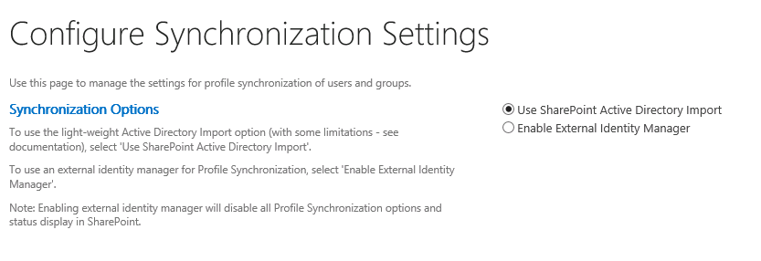

# Module 04- Lab2: Create and Configure User Profile Service

## Microsoft 365 user interface 

Given the dynamic nature of Microsoft cloud tools, you may experience user interface (UI) changes that were made following the development of this training content. This will manifest itself in UI changes that do not match up with the detailed instructions presented in this lab manual.

The Microsoft World-Wide Learning team will update this training course as soon as any such changes are brought to our attention. However, given the dynamic nature of cloud updates, you may run into UI changes before this training content is updated. **If this occurs, you will have to adapt to the changes and work through them in the lab exercises as needed.**

## Lab Scenario 

In the labs of this course you are the Administrator for Adatum Corporation, and you have to setup services

  - Create and Configure User Profile Service Application

In this lab, you will create and configure a SharePoint 2019 User Profile Service.

- **Exercise 1: Create User Profile Service Application (15 minutes)**

  - Task 1: Create a new User Profile Service Application

  - Task 2: Give SharePoint Farm Account rights to Active Directory

  - Task 3: Configure Directory Import

- **Exercise 2: Configure MySites (20 minutes)**

  - Task 1: Configure DNS for the new MySites Web Application

  - Task 2: Configure MySites web application

  - Task 3: Configure IIS Bindings

  - Task 4: Create MySite Host Site Collection

  - Task 5: Configure User Profile Service for MySites

## Objectives

After you complete this lab, you will be able to:

  - Create and configure a SharePoint Server 2019 User Profile Service Application

## Lab Setup 

  - **Estimated Time:** 35 minutes.

## Instructions

## Before you start

### Review the lab virtual machines

The following are the virtual machines provided in this course. You will log in to the VM as a local administrator. The instructor will provide the sign-in information.

  - LON-DC1: Domain controller

  - LON-SP1: SharePoint Server with SharePoint 2019 installed.

  - LON-SP2: SharePoint Server with SharePoint 2019 installed.

  - LON-SQL: SQL Server with SQL Server management tools installed.

## Exercise 1: Create User Profile Service Application

In the first exercise you will walk through the steps to create and configure the User Profile service application.

### Task 1 – Create a new User Profile Service Application 

In this task you will create a new user profile service application.

1.  Log on to **LON-SP1** virtual machine as the SharePoint Farm Administrator (Adatum\\SPFarm).

2.  On the **Start** menu, expand **Microsoft SharePoint 2019 Products**, select **SharePoint 2019 Central Administration**.

3.  In Central Administration, select **Application Management**, then on the Application Management page, under the **Service Applications** section, select **Manage Service Applications**.

4.  On the **Manage Service Applications** page, from the ribbon, select **New**, then select **User Profile Service Application**.

5.  Fill out the following information when presented
    
    - Name: **UPA**
    
    - Select **Create new application** pool, and provide the name: **UPAAppPool.**
    
    - Select **Register new managed account** link to create a new managed account for **ADATUM\\SPProfile** with the password **Pa55w.rd.**
    
    - After the new managed account is created, select **ADATUM\\SPProfile** as the account to use for the application pool.

        (You may have to refill the Name and Application Pool Name again after creating the managed account)

    - Profile Database – Database Name: **UPA\_ProfileDB**

    - Social Tagging Database – Database Name: **UPA\_SocialDB**

    - Select **Create**

    - Once the service application is created, select **OK**

6.  Navigate to **System Settings** page and select **Manage services on server**. Make sure to select the **LON-SP2** server and scroll down.

7.  Notice the **User Profile Service** instance is started automatically due to MinRole configuration.

You have now completed this task and may proceed to the next Task.

### Task 2 – Give SharePoint Farm Account rights to Active Directory 

In this task you will configure the SharePoint Farm Account the necessary permissions on Active Directory to execute the user profile synchronization.

1.  **In your Lab Session, switch to LON-DC1 virtual machine as Administrator.**

2.  On the **Start** menu, select **Windows Administrative Tools**.

3.  Select **Active Directory Users and Computers**.

4.  When the application loads, select **View** from the toolbar and select **Advanced Features.**

      

5.  Right-select the domain name **Adatum.com** and select **Properties.**

6.  Select the **Security** tab

7.  Select the **Add** button and enter **adatum\\spfarm** into the box, then select **Check Names**.  

    

8.  With **SharePoint Farm (SPFarm@Adatum.com)** user selected in the top box, scroll down, and check the box to **Allow** for **Replicating Directory Changes**. 

    

9.  Select **OK**.

You have completed this necessary task for the import to be successful. Please proceed to the next task.

### Task 3 – Configure Directory Import 

In this task you will configure the directory import to populate the user profiles into the service.

1.  Log on to **LON-SP1** virtual machine as the SharePoint Farm Administrator (Adatum\\SPFarm).

2.  On the **Start** menu, expand **Microsoft SharePoint 2019 Products**, select **SharePoint 2019 Central Administration**.

3.  In Central Administration, select **Application Management**, then on the Application Management page, under the **Service Application** section, select **Manage Service Applications**.

4.  Select the recently created User Profile Application, **UPA**.

5.  Under the **Synchronization** section, select **Configure Synchronization Settings**.

6.  Validate **Use SharePoint Active Directory Import** is selected.

    

7.  Select **OK**.

8.  Under the **Synchronization** section, select **Configure Synchronization Connections**.

9.  Select **Create New Connection**.

10. Add a new sync connection with the following information
    
      - Connection Name: **ADATUM**
    
      - Domain Name: **adatum.com**
    
      - Account Name: **ADATUM\\SPFarm**
    
      - Password: **Pa55w.rd**
    
      - Confirm Password: **Pa55w.rd**
    
      - Select **Populate Containers**, this will populate the select box with information from the provided domain.
    
      - Select **IT** and **Users in the containers list and select OK**

        

11. Navigate back to **Application Management**, then on the Application Management page, under the **Service Application** section, select **Manage Service Applications**.

12. Select the recently created User Profile Application, **UPA**.

13. Select **Start Profile Synchronization**

14. Pick **Start Full Synchronization**

15. Select **OK**.
    
    
    - You should be starting out with 0 profiles.

        

    - Synchronization will take a few minutes, **Refresh** the page to see the status of the **Profile Synchronization**. It will start with **Synchronizing**.

        

    - Once it is back to **Idle**, the profile count should now be approx. 40 profiles.

        

16. Once the profiles are imported, select **Manage User Profiles** from the **People** section.

17. In the **Find Profiles** text box, enter **adatum\\user** and select **Find**.
    
    UserA through UserE should be displayed.

You have now completed this task and the exercise. You can proceed to the next Exercise.

### Exercise 2: Configure My Sites

In this exercise you will configure User Profile Service application.

### Task 1 – Configure DNS for the new MySites Web Application 

In this task you will configure a DNS host for the MySites web application.

1.  In your Lab Session, switch to **LON-DC1** virtual machine as Administrator.

2.  On the Start menu, select **Windows Administrative Tools**, and select **DNS.**

3.  In DNS Manager, expand **LON-DC1**, expand Forward Lookup Zones and expand **adatum.com.**

4.  Right-select **adatum.com** and select **New Host (A or AAAA).**

5.  Create a **New Host** with the following information
    
      - Name: **mysites**
    
      - IP Address: **172.16.0.12 (The IP of LON-SP1)**
    
      - Select **Add Host**
    
      - Select **OK** then **Done**.

You have now successfully created the User Profile service application. Proceed to the next task.

### Task 2 – Configure MySites Web Application 

In this task you will configure the MySites web application.

1.  Log on to **LON-SP1** virtual machine as the SharePoint Farm Administrator (Adatum\\SPFarm).

2.  On the **Start** menu, expand **Microsoft SharePoint 2019 Products**, select **SharePoint 2019 Central Administration**.

3.  Select **Application Management**, on the Application Management page, select **Manage Web Applications**.

4.  Select **New** from the ribbon.

5.  Scroll down to Application Pool section and select **Register new managed account**
    
      - User Name: **ADATUM\\SPMySitesWebApp**
    
      - Password: **Pa55w.rd**

6.  Use the following information to create the new web application
    
      - Name: **SharePoint - mysites.adatum.com**
    
      - Port: **80**
    
      - Host Header: **mysites.adatum.com**
    
      - Application Pool Name: **SharePoint - mysites.adatum.com80**
    
      - Application Pool Identity: **ADATUM\\SPMySitesWebApp**.
    
      - Database Name: **MySite\_Content\_01**

7.  Select **OK**.

8.  After it is created, select **OK** to close the summary dialog.

9.  Select the row (not the link) of the new **SharePoint – mysites.adatum.com** web application in the list to highlight the row.

10. Select **Managed Paths** from the ribbon.

11. In the **Define Managed Paths** dialog box, select the box for **Sites** and select **Delete selected paths**.

12. In the **Define Managed Paths** dialog box, under **Add a New Path**, enter **personal** into the **Path** text box and select **Wildcard inclusion** for the **Type**, then select **Add Path**.  

    

13. Select **OK**.

### Task 3 – Configure IIS Bindings 

In this task you will configure the IIS Bindings for the mysites web application.

1.  Log on to **LON-SP1** virtual machine as the SharePoint Farm Administrator (Adatum\\SPFarm).

2.  On the **Start** menu, select **Windows Administrative Tools** then select **Internet Information Services (IIS) Manager**.

3.  In IIS Manager, expand **LON-SP1 (Adatum\\Administrator)**, expand **Sites** and click on **SharePoint – mysites.adatum.com**.

4.  In the **Actions** pane on the right, select **Bindings**.

5.  In the **Site Bindings** dialog box, highlight the mysites.adatum.com binding and select **Edit**.

6.  In the **IP address** selector, select **172.16.0.12**.

    

7.  Click **OK** then select **Close**.

This task is now complete, please continue to the next task.

### Task 4 – Create MySite Host Site Collection 

In this task you will configure the mysite web application to have a mysite host at the root of the web application.

1.  Log on to **LON-SP1** virtual machine as the SharePoint Farm Administrator (Adatum\\SPFarm).

2.  On the **Start** menu, expand **Microsoft SharePoint 2019 Products**, select **SharePoint 2019 Central Administration**.

3.  In Central Administration, select **Application Management**, then on the Application Management page, under the **Site Collections** section, select **Create site collections**.

4.  Create a site collection, with the following information
    
      - Web Application: [**http://mysites.adatum.com**](http://mysites.adatum.com)
    
      - Title: **My Site Host**
    
      - Description: **Site is used for the user profiles and pictures**
    
      - URL: **/**
    
      - Template Selection: **My Site Host** *(in the Enterprise Tab)*
    
      - Primary Site Collection Administrator: **adatum\\administrator**

5.  Select **OK**.

6.  After it successfully creates go to **Application Management \> Manage web applications**

7.  Select the row (not the link) **SharePoint – mysites.adatum.com**

8.  Select **Self-Service Site Creation** from the ribbon.

9.  In the **Self-Service Site Creation Management** dialog box, under **Site Collections**, select **On** and then select **OK**.

You have now completed this task, please continue to the next task.

### Task 5 – Configure User Profile Service for MySites 

In this task you will configure the user profile service to use the new my sites web application.

1.  Log on to **LON-SP1** virtual machine as the SharePoint Farm Administrator (Adatum\\SPFarm).

2.  On the **Start** menu, expand **Microsoft SharePoint 2019 Products**, select **SharePoint 2019 Central Administration**.

3.  Select **Application Management**, then in the Application Management page, select **Managed Service Applications** from the **Service Applications** section.

4.  Click the **UPA link**

5.  On the **Manage Profile Service: UPA** page, under **My Site Settings** section, select **Setup My Sites**.

6.  On the **My Site Settings** page, in the **My Site Host Location** text box, type **http://mysites.adatum.com**, uncheck the box for **Make My Sites Public**, and then select **OK**.

7.  To test mysites is working in you Lab Session, switch to **LON-CL1** virtual machine.

8.  Log on to **LON-SP1** virtual machine as **Adatum\\UserA**

9.  Open **Internet Explorer** from the taskbar and navigate to **http://mysites.adatum.com**.

10. OneDrive will then start being provisioned and you will see the following screen.

    

11. In few minutes you can refresh the page and the OneDrive will be ready for UserA to interact with.

    [Screenshot with the message Your OneDrive is ready](media/M04_2/image13.png)

You have now completed this task and the exercise. You have completed this lab.

END OF LAB
