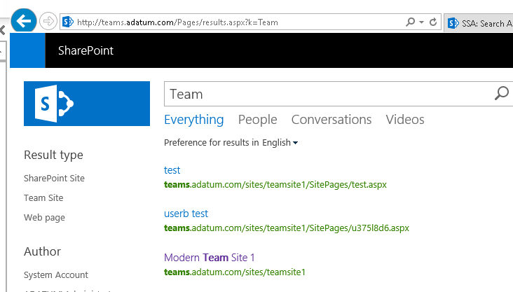

# Module 06-Lab 1: Create and Configure Search Service

## Microsoft 365 user interface 

Given the dynamic nature of Microsoft cloud tools, you may experience user interface (UI) changes that were made following the development of this training content. This will manifest itself in UI changes that do not match up with the detailed instructions presented in this lab manual.

The Microsoft World-Wide Learning team will update this training course as soon as any such changes are brought to our attention. However, given the dynamic nature of cloud updates, you may run into UI changes before this training content is updated. **If this occurs, you will have to adapt to the changes and work through them in the lab exercises as needed.**

## Lab Scenario 

In the labs of this course you are the Administrator for Adatum Corporation, and you have to setup services

  - Create and Configure Search Service Application

In this lab, you will create and configure a SharePoint 2019 Business Connectivity Service.

- **Exercise 1: Create Search Service Application (15 minutes)**

    - Task 1: Create a new Search Service Application
    - Task 2: Crawl Content

## Objectives

After you complete this lab, you will be able to:

  - Create and Configure a SharePoint Server 2019 Search Service Application

## Lab Setup 

  - **Estimated Time:** 20 minutes.

## Instructions

## Before you start

### Review the lab virtual machines

The following are the virtual machines provided in this course. You will log in to the VM as a local administrator. The instructor will provide the sign-in information.

  - LON-DC1: Domain controller

  - LON-SP1: SharePoint Server with SharePoint 2019 installed.

  - LON-SP2: SharePoint Server with SharePoint 2019 installed.

  - LON-SQL: SQL Server with SQL Server management tools installed.

## Exercise 1: Create Search Service Application

In the first exercise you will walk through the steps to create and configure the search service application.

### Task 1 – Create a new Search Service Application 

In this task you will create the Search Service application.

1.  Log on to **LON-SP1** virtual machine as the SharePoint Farm Administrator (Adatum\\SPFarm).

2.  On the **Start** menu, expand **Microsoft SharePoint 2019 Products**, select **SharePoint 2019 Central Administration**.

3.  In Central Administration, select **Application Management**, then on the Application Management page, under the **Service Applications** section, select **Manage Service Applications**.

4.  On the **Manage Service Applications** page, on the ribbon, select **New** then select **Search Service Application**.

5.  Use the following information to populate the request for a new search service application.
    
      - Select **Register new managed account** link to create **ADATUM\\SPSearch** as a managed account.
    
      - Service Application Name: **SSA**
    
      - Search Service Account: **ADATUM\\SPSearch**
    
      - For **Application Pool for Search Admin Web Service**, use the following information:
        
          - Name: **SPSearchAdminAppPool**
        
          - Security Account for this application pool: **ADATUM\\SPSearch**
    
      - For **Application Pool for Search Query and Site Settings Web Service**, use the following information:
        
          - Name: **SPSearchSQSSAAppPool**
        
          - Security Account for this application pool: **ADATUM\\SPSearch**
    
      - Select **OK**.

6.  Once it is created (may take a few min), select **OK** on the creation summary dialog.

You have now successfully created the Search service application. Proceed to the next task.

### Task 2 – Crawl Content 

In this task you will configure the search service application to crawl the content.

1.  Log on to **LON-SP1** virtual machine as the SharePoint Farm Administrator (Adatum\\SPFarm).

2.  On the **Start** menu, expand **Microsoft SharePoint 2019 Products**, select **SharePoint 2019 Central Administration**.

3.  In Central Administration, select **Application Management**, then on the Application Management page, under the **Service Applications** section, select **Manage Service Applications**.

4.  Select the **SSA** link.

5.  On the **SSA: Search Administration** page, on the menu on the left side, select **Content Sources** under the **Crawling** section.

6.  On the **SSA: Content Sources** page, select the content source **Local SharePoint Sites, and verify if the following URLs are in the starting addresses:**
    
    * http://mysites.adatum.com
    * http://teams.adatum.com
    * sps3://mysites.adatum.com

7.  **Select the dropdown menu for Local SharePoint Sites, and select Start Full Crawl, then select OK on the alert pop up.**

8.  **Go back to the SSA: Search Administration** page, on the menu on the left side, select **Crawl Log** under the **Diagnostics** section, then select **Crawl History**.

9.  Refresh the page until the **Full Crawl** (*Type* F) has completed. (May take a few minutes).

10. Once complete, navigate to **http://teams.adatum.com** share the site with **adatum\\UserA**

11. Search for **Team**

    

You have now completed this task and the exercise. You have completed this lab.

END OF LAB
