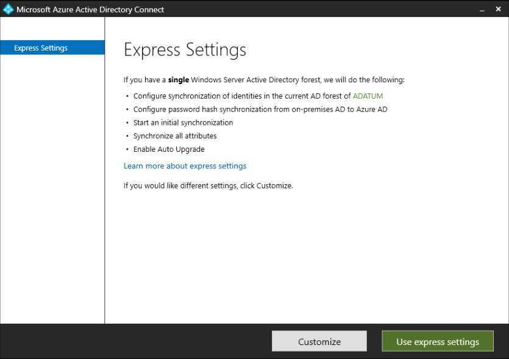
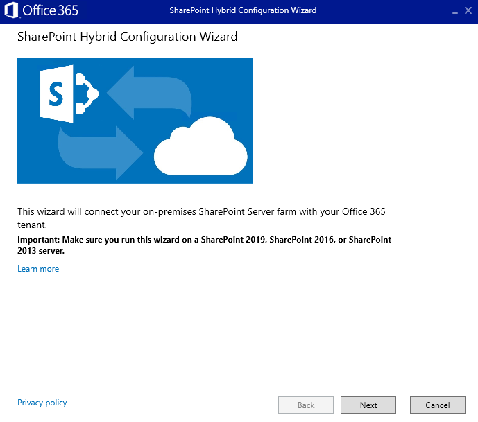

# Module 09-Lab 1: Configuring SharePoint Hybrid'

## Microsoft 365 user interface 

Given the dynamic nature of Microsoft cloud tools, you may experience user interface (UI) changes that were made following the development of this training content. This will manifest itself in UI changes that do not match up with the detailed instructions presented in this lab manual.

The Microsoft World-Wide Learning team will update this training course as soon as any such changes are brought to our attention. However, given the dynamic nature of cloud updates, you may run into UI changes before this training content is updated. **If this occurs, you will have to adapt to the changes and work through them in the lab exercises as needed.**

## Lab Scenario 

In the labs of this course you are the SharePoint Administrator for Adatum Corporation, and you have a SharePoint 2019 farm deployed in a virtualized lab environment. In this lab, you will configure SharePoint Hybrid Scenarios.

- **Exercise 1: Set up your M365 lab environment ( 5 minutes)**

  - Task 1: Obtain your Microsoft 365 credentials
  - Task 2: Sign in to Microsoft 365


- **Exercise 2: Sync OnPrem users to AAD ( 25 minutes)**

  - Task 1: Configure UPN Suffix
  - Task 2: Enable Directory Synchronization
  - Task 3: Run Azure AD Connect
  - Task 4: Assign users with Microsoft 365 licenses


- **Exercise 3: Configuring SharePoint Hybrid ( 30 minutes)**

  - Task 1: Turn on the Microsoft SharePoint Foundation Subscription Settings Service
  - Task 2: Install and run SharePoint Hybrid Configuration Wizard
  - Task 3: Configure search result

## Objectives

After you complete this lab, you will be able to:

  - Configure and deploy SharePoint Hybrid scenarios.

## Lab Setup 

  - **Estimated Time:** 60 minutes.

## Instructions

## Before you start

### 1. Review the lab virtual machines

The following are the virtual machines provided in this course. You will log in to the VM as a local administrator. The instructor will provide the sign-in information.

  - LON-DC1: Domain controller
  - LON-SP1: SharePoint Server with SharePoint 2019 installed.
  - LON-SP2: SharePoint Server with SharePoint 2019 installed.
  - LON-SQL: SQL Server with SQL Server management tools installed.

### 2. Review Microsoft 365 tenant

Once you launch the VM, a free trial tenant will be made available to you. The following are the details about the Microsoft 365 tenant:

  - Microsoft 365 E5.

  - 15 licenses with ten pre-assigned (5 available of 15).

  - One Global Administrator (MOD Administrator) and nine normal users have been pre-created.

  - Global Administrator (MOD Administrator) is **admin@YourTenant.onmicrosoft.com**.

**Note:** **YourTenant**.onmicrosoft.com is the domain associated with the Microsoft 365 tenant provided by the lab hosting provider. **YourTenant** is the unique tenant ID and different to each student.

## Exercise 1: Set up your lab environment

In the first exercise you will walk through the steps to setup your lab environment.

### Task 1: Obtain your Microsoft 365 Credentials 

1.  The **M365 Credentials** will be provided by the instructor.

### Task 2: Sign in to Microsoft 365 

In this task you will open Edge browser and navigate to Microsoft 365 Portal to sign in with the credentials obtained in the previous task.

1.  Log on to **LON-SP1** virtual machine as the SharePoint Farm Administrator (Adatum\\SPFarm).

2.  Open **Edge** or **IE** and enter **https://portal.office.com** into the address bar and press **Enter**.

3.  You should be presented a sign in dialog box, if you are directed to the page instead, select **Sign In** from the upper right of the page. If you are presented the sign in dialog box, **copy and paste the M365 Credential Username** into the box presented, select **Next**.

4.  In the next screen, **copy and paste the M365 Credential Password** into the box presented, select **Sign In**.

5.  When it asks if you would like to **Stay signed in?** then select **Yes** to stay signed in.

You have now completed this task and the exercise.

## Exercise 2: Setting up your organization for identity synchronization

You are the security administrator for Adatum Corporation, and you have Microsoft 365 deployed in a virtualized lab environment. In this lab, you will implement identity synchronization between your Microsoft 365 tenant accounts and your local active directory accounts.

### Task 1: Configure your UPN suffix

1.  On **LON-DC1**, log on as **adatum\\Administrator** and use password assigned to your lab.

2.  Run **Windows PowerShell ISE** as administrator, update the UPN suffix for the domain and on the UPN on every user in AD DS with “@**YourTenant**.onmicrosoft.com” (where **YourTenant** is your unique UPN name) for the domain name. To do this, run the following command (remember to change **YourTenant** to your unique UPN name):

    ```powershell
    Import-Module ActiveDirectory
    $upn = "YourTenant.onmicrosoft.com"
    Set-ADForest -Identity Adatum.COM -UPNSuffixes @{Add=$upn}

    $ou = "CN=Users,DC=Adatum,DC=com"
    $oldSuffix = "Adatum.com"
    $password = "Pa55w.rd"

    Get-ADUser -SearchBase $ou -filter {Name -like "user*"} | ForEach-Object {
        $_ | Set-ADAccountPassword -reset -newpassword (ConvertTo-SecureString -AsPlainText $password -Force)
        $_.UserPrincipalName
        $newUpn = $_.UserPrincipalName.Replace($oldSuffix, $upn)
        $_ | Set-AdUser -UserPrincipalName $newUpn -EmailAddress  $newUpn -ChangePasswordAtLogon $false
    }

    $serviceUpn = "spfarm@" + $upn
    Set-ADUser -Identity spfarm -UserPrincipalName $serviceUpn -EmailAddress $serviceUpn   

    ```

3.  To confirm the change, open **Active Directory Administrative** Center, and navigate to the **UserA** under **Users** OU. You should see the value of Users UPN logon been changed to for Yes to **YourTenant**.onmicrosoft.com.

### Task 2: Enable Directory Synchronization

1.  On **LON-DC1**, log on as **adatum\\Administrator** and use password assigned to your lab.

2.  Open your browser and go to <https://portal.office.com/>

3.  Sign in as **admin@YourTenant.onmicrosoft.com** with the password for M365 Credentials.

4.  Select **Admin** to go to the Microsoft 365 admin center.
    
      - If asked about **update your admin contact information** select the Cancel button to skip this request.
    
      - **Note:** If you see the Active Directory synchronization is being activated warning, you can ignore it at this time, but you will not be able t2o run directory synchronization later in this exercise. You must wait until directory synchronization is activated. However, you can complete the following steps, even if you do see the warning message.

5.  In the left navigation, select **Setup** icon and under **Sign-in and security** select **View** under **Sync users from your org’s directory**.
    
    1.  Select **Get Started**
    
    2.  Select **Next** – we are not running IdFix for this lab**.**
    
    3.  Select **Download Azure AD Connect** – it will open new window.
    
    4.  Select **Save** to download AzureADConnect.msi.
    
    5.  Select **Open folder.**

### Task 3: Run Azure AD Connect

1.  On **LON-DC1**, log on as **adatum\\Administrator** and use password assigned to your lab.

2.  Go to downloads folder, double-select **Azure AD Connect,** and select **Run.**

3.  Run **Azure AD Connect**.
    
    1.  On the Welcome screen, select the box agreeing to the licensing terms and select **Continue**.
        
        
    
    2.  On the **Express settings** screen, select **Use express settings**.

        

    3.  On the **Connect to Azure AD** screen, enter the Microsoft 365 admin credential ([admin@YourTenant.onmicrosoft.com](mailto:admin@yourtenant.onmicrosoft.com)), and hit **Next**.  
    
        

    4.  On the Connect to AD DS screen, enter “Adatum\\administrator” account and password (Pa55w.rd) and click **Next**.  
    
        

    5.  On the [Azure AD sign-in configuration](https://docs.microsoft.com/en-us/azure/active-directory/connect/active-directory-aadconnect-user-signin#azure-ad-sign-in-configuration) page choose “**Continue without matching all UPN suffixes to verified domains**” and select **NEXT** to continue.

    6.  On the Ready to configure screen, select the “**Start the synchronization process when configuration completes**” checkbox, then select **Install**.

        

    7.  When the installation completes, select **Exit**. This process can take about 5 to 10 minutes to complete.

        

### Task 4: Assign users the Microsoft 365 licenses

1.  On **LON-DC1**, log on as **adatum\\Administrator** and use password assigned to your lab.

2.  Open your browser and go to <https://portal.office.com/>.

3.  Sign in as **admin@YourTenant.onmicrosoft.com** with the password for M365 Credentials.

4.  Browse to **Microsoft 365 Admin Center.**

5.  In the left pane, select **Active users** under Users.

6.  Find and select **UserA - UserE.** (You can search with keyword “user”)

7.  Select all users and select **Manage product licenses** on the top.

    

8.  Then select **Add to existing products license assignments** and choose **Next**.

9.  Select the slider beside **Microsoft/Office 365 E5** to active the licenses.

10. Select **Add** then **Close**.

11. Go to <https://YourTenant.SharePoint.com> , select **Share** at up-right corner, and share the site with **UserA**.

You have successfully synced local ADATUM users into Microsoft 365 and assigned licenses. You have now completed this exercise you may proceed to next one.

## Exercise 3: Configuring SharePoint Hybrid

### Task 1: Turn on the Microsoft SharePoint Foundation Subscription Settings Service

1.	Log on to **LON-SP1** virtual machine as the SharePoint Farm Administrator (Adatum\SPFarm).

2.  Go to SharePoint 2019 Central Administration.

3.  Select **System Settings** \> **Manage Services in Farm**, and **Enable Auto Provision** for **Microsoft SharePoint Foundation Subscription Settings Service.**

4.  Select **System Settings** \> **Manage services on server**, and start **Microsoft SharePoint Foundation Subscription Settings Service.**


### Task 2: Install and run SharePoint Hybrid Configuration Wizard

1.	Log on to **LON-SP2** virtual machine as the SharePoint Farm Administrator (Adatum\SPFarm).

2.  Install **prerequisites** for Hybrid Search configuration.
    
    1.  **Microsoft Online Services Sign-In Assistant:**
        
        Download and install **msoidcli\_64.msi** via link (<https://www.microsoft.com/en-us/download/details.aspx?id=39267>).

        (You might need to restart the machine to finish the installation.)

    2.  **MSOnline AAD PowerShell module:**
        - Open Windows PowerShell and run as administrator.
        - Run following command and Yes to prompt questions.

        ```powershell
        Install-Module -name MSonline -SkipPublisherCheck -Force
        ```
        - Note: We are forcing the install and ignoring the publish check to make sure we override the module with newest available
    
3.  Go to **SharePoint 2019 Central Administration (**[http://lon-sp2:50000](http://lon-sp2:50000/) **)** \> **Office 365 \>** Select **Launch the Hybrid Configuration Wizard** \> Select **Run** to install and launch the wizard.

4.  Run the **Hybrid Configuration Wizard**
    
    1.  This will launch the **SharePoint Hybrid Picker Wizard** Configuration Wizard. Select **Next**.

        

5.  On the Credentials page enter:
    
      - **Farm Admin** (Adatum\\**SPFarm) or check use my current credentials.**
    
      - **Global Administrator** (<admin@YourTenant.onmicrosoft.com>) credential.
    
      - Select **Validate Credentials** to continue.

        

6.  Once the **Validation** finishes, select **Close then Next**.

7.  After all prerequisites succeed, select **Next**.

    

8.  Keep all the default features to include and check the box for **Hybrid Search.** Verify following hybrid features are checked.
    
    1.  Hybrid OneDrive
    
    2.  My Site creation default to OneDrive in Microsoft 365
    
    3.  Hybrid Sites
    
    4.  Hybrid business to business (B2B) sites
    
    5.  Hybrid app launcher
    
    6.  Hybrid Search

        

9.  Select **Input Parameters** next to **Hybrid Search.** Enter following information in the popup window and click **OK.**
    
    1.  On-premises SharePoint server: **LON-SP2**
    
    2.  On-premises SQL database server: **LON-SQL**
    
    3.  Name for the cloud Search service application: **CloudSSA**
    
    4.  **Check the box** to validate installed MSOnline AAD PowerShell module and Microsoft Online Services Sign-In Assistant

        

10.  Select **Next** to start the configuration. (It might take more than 10 minutes to finish the wizard.)
    

11.  Select **Close** when Configuration completes.
    

### Task 2: Configure search result

1.  Log on to **LON-SP1** virtual machine as the SharePoint Farm Administrator (Adatum\\SPFarm).

2.  **Crawl on-premises content**
    
    1.  Open Edge or IE
    
    2.  Go to **SharePoint 2019 Central Administration (**<http://lon-sp2:50000> **)** \> Manage service applications \> CloudSSA.
    
    3.  Select content source in left pane.
    
    4.  Select the default content source named **Local SharePoint Sites**, and verify if the URL (<http://teams.adatum.com>) is in the start addresses. If not, add it to the text box, and select **OK.**
    
    5.  Back to content source page, select the dropdown menu next to the content source, and start the full crawl.

3.  **Create remote result source**
    
    1.  Go to **SharePoint 2019 Central Administration (**<http://lon-sp2:50000> **)** \> Manage service applications \> CloudSSA.
    
    2.  Select **Result Sources**, and then select **New Result Source**.
    
    3.  On the **Search Result Sources** page, do the following:
        
          - In the **Name** text box, type a name for the new result source (for example, Hybrid RS).
        
          - For **Protocol**, select **Remote SharePoint**.
        
          - For the **Remote Service URL**, type the address of the root site collection of the SharePoint in Microsoft 365 (https://YourTenant.sharepoint.com/)
        
          - For the **Type**, select **SharePoint Search Results**.
        
          - Leave **Query Transform** as **default** which is {searchTerms}.
        
          - Leave **Credentials Information** as **default** which is Default Authentication.
        
          - Select **Save** to save the new result source.

4.  You will be redirected back to the **Result Sources** page.

5.  Select the dropdown menu of the **Result Source** you just created and set it as default.

6.  **Change Service Connections**.
    
    1.  Go to **SharePoint 2019 Central Administration (**<http://lon-sp2:50000> **)** \> **Application Management** \> **Configure Service Application Associations.**
    
    2.  Select the **default** proxy group.
    
    3.  On the Associations popup, check the box beside the **CloudSSA** Proxy you created, and then select **set as default**. (Uncheck SSA proxy if it is checked.)
    
    4.  Select **OK**

7.  **Validate Search Results**
    
    1.  Sign in to **LON-CL1** virtual machine as Adatum\\UserA.

        Note: If you cannot login to the LON-CL1 with the userA, verify as administrator that the userA is added to local group on LON-CL1 for remote access users.

    2.  Launch **Internet Explorer** and browse to enterprise search center [http://teams.adatum.com](http://teams.adatum.com/).

    3.  Within the **search** text box, try to search following query string.
    
        - IsExternalContent:0
        - IsExternalContent:1

    4.  Go to <https://YourTenanat.sharepoint.com> log in as <userA@Yourtenant.onmicrosoft.com> with password: Pa55w.rd

    5.  In the Search box (middle-top) type:
    
        - IsExternalContent:0
        - IsExternalContent:1

    6.  In both search centers you can alidate that the Search results are coming for the Online (IsExternalContent:0) & On-Premises content (IsExternalContent:1).

You have reached the end of the task and the exercise. You have completed the Lab.

END OF LAB
