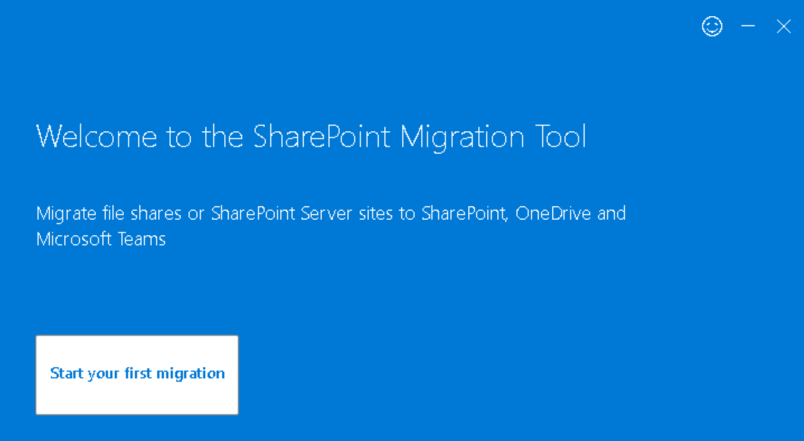
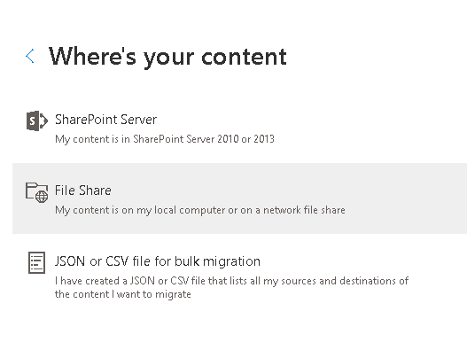
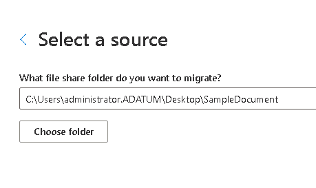
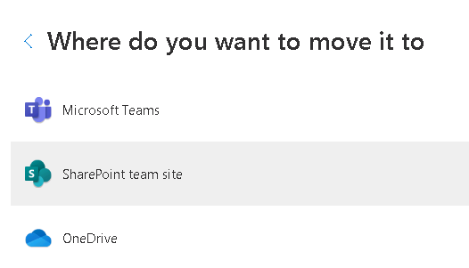
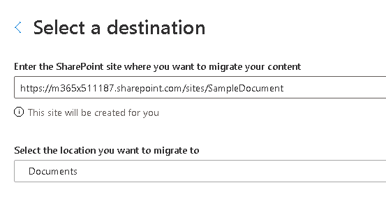
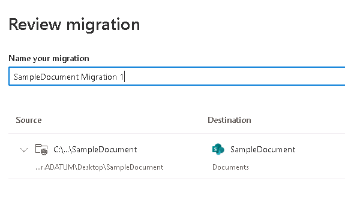
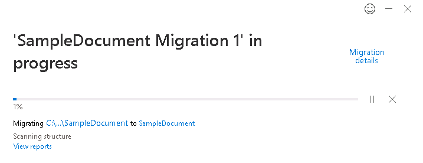
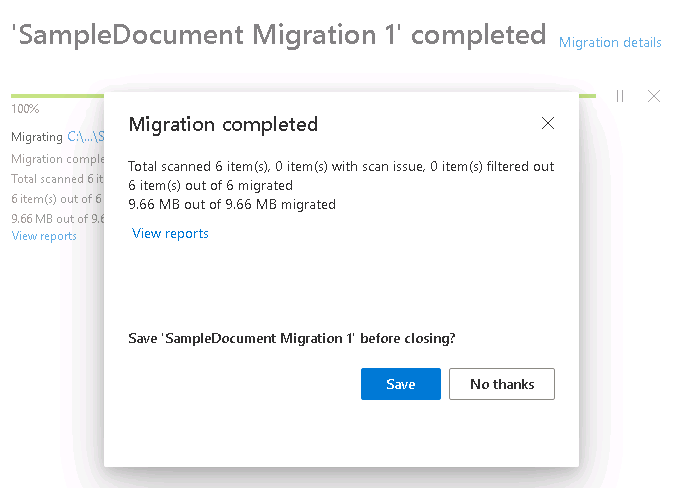
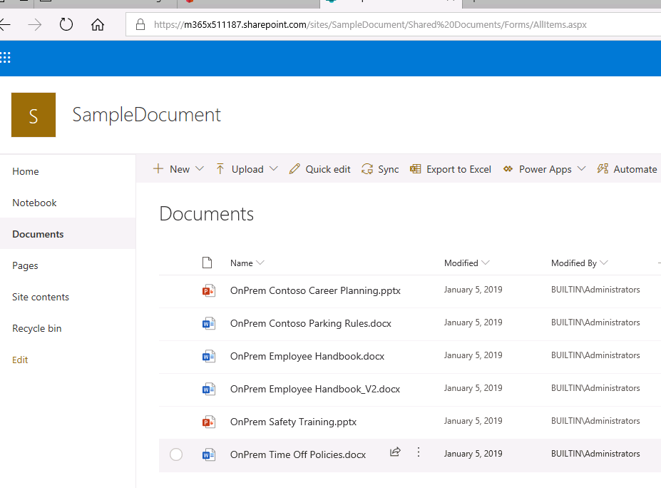

# Module 11-Lab 1: Migrate to SharePoint in Microsoft 365

## Microsoft 365 user interface 

Given the dynamic nature of Microsoft cloud tools, you may experience user interface (UI) changes that were made following the development of this training content. This will manifest itself in UI changes that do not match up with the detailed instructions presented in this lab manual.

The Microsoft World-Wide Learning team will update this training course as soon as any such changes are brought to our attention. However, given the dynamic nature of cloud updates, you may run into UI changes before this training content is updated. **If this occurs, you will have to adapt to the changes and work through them in the lab exercises as needed.**

## Lab Scenario 

In the labs of this course you are the Administrator for Adatum Corporation, and you must Migrate content to SharePoint online

  - Migrate to SharePoint Online

In this lab, you will migrate files to SharePoint in Microsoft 365.

- **Exercise 1: Set up your lab environment (5 minutes)**

  - Task 1: Obtain Microsoft 365 credentials

  - Task 2: Sign in to Microsoft 365

- **Exercise 2: Migrate files to SharePoint in Microsoft 365 (15 minutes)**

  - Task 1: Download and install SharePoint Migration Tool

  - Task 2: Migrate content to SharePoint Online with SPMT

## Objectives

After you complete this lab, you will be able to:

  - Setup and migrate files to SharePoint in Microsoft 365 with use of SPMT

## Lab Setup 

  - **Estimated Time:** 20 minutes.

## Instructions

## Before you start

#### 1. Review the lab virtual machines

The following are the virtual machines provided in this course. You will log in to the VM as a local administrator. The instructor will provide the sign-in information.

  - LON-DC1: Domain controller

  - LON-SP1: SharePoint Server with SharePoint 2019 installed.

  - LON-SP2: SharePoint Server with SharePoint 2019 installed.

  - LON-SQL: SQL Server with SQL Server management tools installed.

### 2. Review Microsoft 365 tenant

Once you launch the VM, a free trial tenant will be made available to you. The following are the details about the Microsoft 365 tenant:

  - Microsoft 365 E5.

  - 15 licenses with ten pre-assigned (5 available of 15).

  - One Global Administrator (MOD Administrator) and nine normal users have been pre-created.

  - Global Administrator (MOD Administrator) is **admin@YourTenant.onmicrosoft.com**.

**Note:** **YourTenant**.onmicrosoft.com is the domain associated with the Microsoft 365 tenant provided by the lab hosting provider. **YourTenant** is the unique tenant ID and different to each student.

## Exercise 1: Set up your lab environment

In the first exercise you will walk through the steps to setup your lab environment.

### Task 1 – Obtain your Microsoft 365 Credentials 

The **M365 Credentials** will be provided by the instructor.

In this task you will get the credentials needed to connect to Microsoft 365. When you launch the labs in this course, a free trial tenant will be automatically created for you to access Microsoft 365 in the virtual lab environment. This tenant will automatically assign a unique username and password. You must retrieve this username and password so you can sign into Microsoft 365 within the lab environment.

### Task 2 – Sign in to Microsoft 365 

In this task you will open Edge browser and navigate to Microsoft 365 Portal to sign in with the credentials obtained in the previous task.

1.  In your Lab Session, switch to **LON-CL1** virtual machine (up-right corner) as Administrator.

2.  Open **Edge** and enter **https://portal.office.com** into the address bar and press **Enter**.

3.  You should be presented a sign in dialog box, if you are directed to the page instead, select **Sign In** from the upper right of the page. If you are presented the sign in dialog box, copy and paste the **M365 Credential Username** into the box presented, select **Next**.

4.  In the next screen, copy and paste the **M365 Credential Password** into the box presented, select **Sign In**.

5.  When it asks if you would like to **Stay signed in?** then select **Yes** to stay signed in.

You have now completed this task and the exercise.

## Exercise 2: Migrate files to SharePoint Online

In this exercise we will use the SharePoint Migration Tool to migrate content into SharePoint Online.

### Task 1 – Download and install SharePoint Migration Tool 

In this task you will download and install the SharePoint migration tool.

1.  In your Lab Session, switch to **LON-CL1** virtual machine as Administrator.

2.  Open **Edge** and got to SharePoint Admin Center ([https://YourTenant-admin.SharePoint.com](https://yourtenant-admin.sharepoint.com/) )

3.  Select **Migration** \> Desktop tool (SPMT) \> Download Tool

4.  You will have to present the M365 Credentials during the installation process.

5.  Once SPMT is installed, you can see the welcome page of SPMT

    

You have completed this task, please continue to the next task.

### Task 2 – Migrate content to SharePoint Online with SPMT 

In this task you will migrate content into SharePoint Online with SPMT.

1.  In your Lab Session, switch to **LON-CL1** virtual machine as Administrator.

2.  From the welcome menu, select **Start your first migration**.

3.  Select **File Share**.  
    
    

4.  Select **Choose folder**, then select the folder **SampleDocument** on the **Desktop**. Then select **Next**.  

    

5.  In the **Where do you want to move it to?** Screen, select **SharePoint Team Site**. 

    

6.  In the **Select a destination** screen, it will auto populate the site collection destination based on the SampleDocument folder we selected. You can leave the defaults selected. It will check if the site exists and in about 20 seconds refresh itself and show a selection box for what library to upload the content into. Select **Next** to continue.  

    

7.  The final screen will be a review of what is selected. Here you can name your migration and review what is planned to be migrated. You could also add additional sources to this migration plan. If everything looks good, select **Next**.  

    

8.  In the **Choose your settings** screen, leave the default settings. Select **View All Settings** to see all the available settings. Hover over the information icon next to each setting to learn more. Select **Migrate**.

9.  A screen will come up so you can watch the progress of the migration

    

10. When the migration is done you will be presented with a summary and an option to save the migration plan details. Select **No Thanks** to continue. Then select the **X** in the top right to close the migration progress window. 

    

11. Navigate to the destination to validate the documents were migrated successfully. The URL is <https://YourTenant.sharepoint.com/sites/sampledocument>. Please replace the \[YourTenant\] with your tenant name.

    

You have reached the end of the task and the exercise. You have completed the Lab.

END OF LAB
